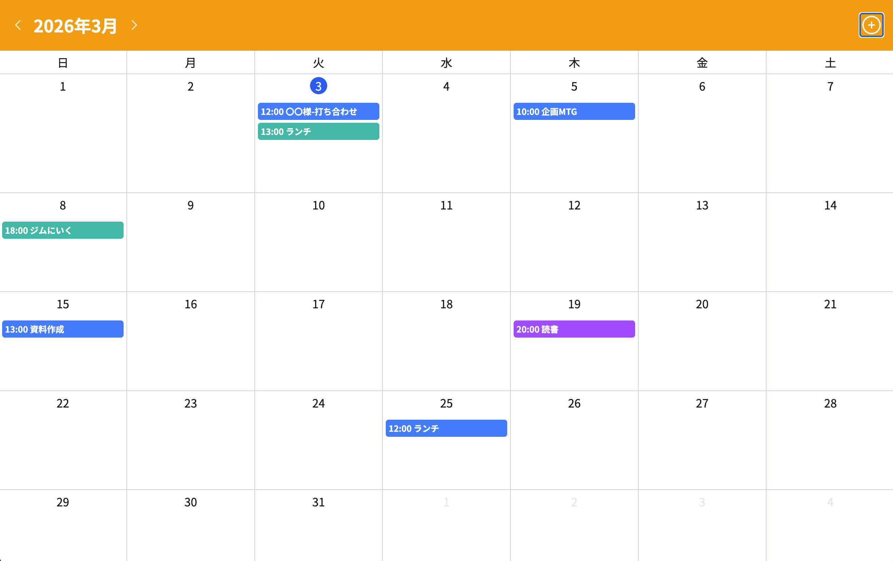
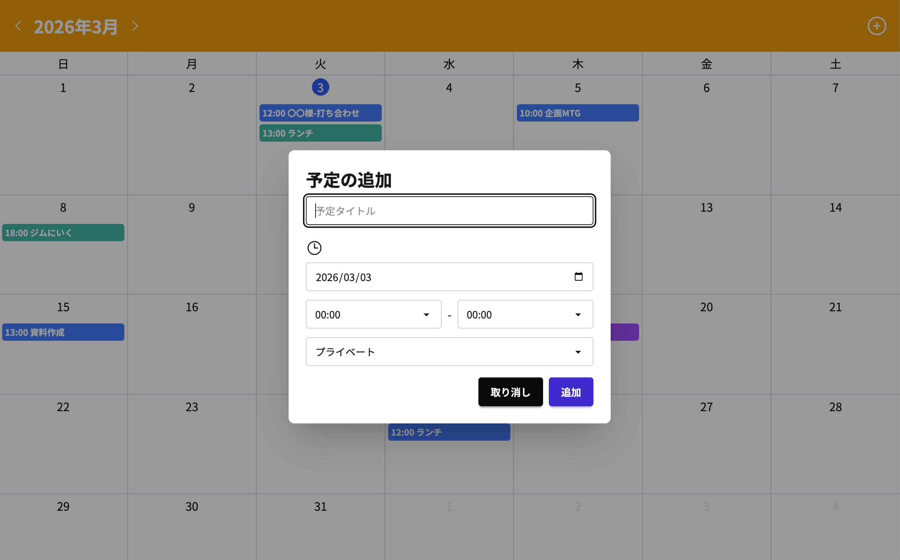

# 📅 カレンダー管理システム (Full-stack Calendar App)

本プロジェクトは、**ZeroPlus Webアプリケーションコース**の課題制作をベースに、実用性を高めるための**「カテゴリ別色分け・管理機能」を独自に設計・実装**した作品です。

## 🌟 独自追加・カスタマイズ機能
スクールの基本カリキュラム（カレンダー表示・CRUD）に加え、以下の機能を自力で拡張しました。

* **カテゴリ分類機能**: 予定を「仕事」「プライベート」「その他」に分類して登録可能に。
* **動的バッジカラーの実装**: カテゴリに応じてカレンダー上のバッジ色を自動で切り替えるロジックを追加。
* **タイムセレクトのコンポーネント化**: 15分刻みの時間選択UIをReactコンポーネントとして共通化し、コードの再利用性を向上。

## 📸 画面イメージ

| マンスリービュー | 予定追加・編集（独自拡張） |
| :--- | :--- |
|  |  |
| 当日ハイライトとカテゴリ別の色分け表示 | daisyUIを活用した直感的な入力フォーム |

## ✨ 主な機能
* **カレンダー操作**: `date-fns` を使用。前月・翌月への切り替え、今日の日付の自動ハイライト。
* **フルセットCRUD**: Node.js(Express) + MySQL を使用した予定の作成・取得・更新・削除。
* **入力バリデーション**: タイトル未入力チェック、開始/終了時間の矛盾防止アラート。
* **レスポンス設計**: `Fetch API` を用いた非同期通信による、ページ遷移のないスムーズな操作感。

## 🛠️ 技術スタック

### Frontend
- **React 18** / **TypeScript**
- **TailwindCSS** / **daisyUI** (UIコンポーネントライブラリ)
- **date-fns** (日付操作ライブラリ)
- **Vite** (ビルドツール)

### Backend / Infrastructure
- **Node.js** / **Express**
- **MySQL** (mysql2)

## 📁 プロジェクト構成
.
├── backend/            # Expressサーバー / APIエンドポイント
│   └── server.js       # MySQL接続・CRUD処理の実装
├── src/
│   ├── components/     # UIコンポーネント (Header, Body, Modal, TimeSelect)
│   ├── App.tsx         # 全体の状態管理・API通信ロジック
│   └── main.tsx        # エントリーポイント
└── package.json        # 依存関係管理

## 🚀 技術的な工夫と学び

### 1. 既存コードへの機能追加（DBからフロントまで）
既存のコードベースを読み解き、DBのテーブル定義（categoryカラムの追加）から、SQLクエリ、フロントエンドのインターフェース定義までを一貫して修正しました。「他人が書いたコード（または過去の自分）を理解し、拡張する」という実践的な開発経験を得ることができました。

### 2. コンポーネントの分割と可読性
モーダル内の複雑な時間選択ロジックを `TimeSelect` コンポーネントとして分離しました。これにより `EventModal` の見通しを良くし、メンテナンス性を高めています。

### 3. TypeScriptによる堅牢な開発
`CalendarEvent` 型を厳密に定義することで、APIから取得したデータとUIコンポーネント間で発生しがちな「データの不整合」を未然に防いでいます。

## 👤 制作
- **ZeroPlus Webアプリケーションコース** 課題制作
- **独自機能拡張**: 磯部晴香 ([@haruka-2431](https://github.com/haruka-2431))